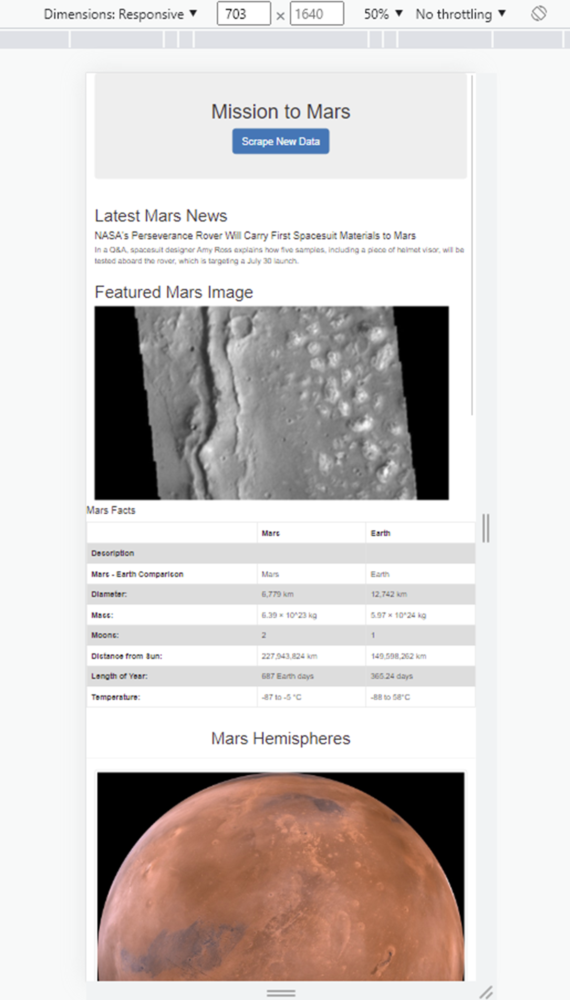

# Mission to Mars

## Objective

The purpose of this project was to create a web application that scrapes data from various websites and displays it in a single HTML page, using Flask, Bootsrap and Python

## Results

We used Juypyter Notebook to scrape full resolution of Mars's Hemispheres alongside its and names from the site: https://marshemispheres.com/' and stored them into a dictionary that was then added to our APP so it was displayed on our HTML page. 

- The following image shows the dictionary created once the data was scraped:

- The image in below is the results of adding the scraped data to our HTML webpage:

## Adding Bootstrap 3 to the page

- Finally, we added some style to the page by stylizing the button to be smaller relative to the headline and also by making the featured image a circle to fit the theme of planetary data. 

- The image below is how it looks in mobile mode. This is a partial view because the page is too long to display completely here.

## Summary

We successfully created a page that aesthetically displays the data collected, is mobile-responsive and uses Bootstraps 3 components to style the webpage creating a user-friendly scraping tool. 

